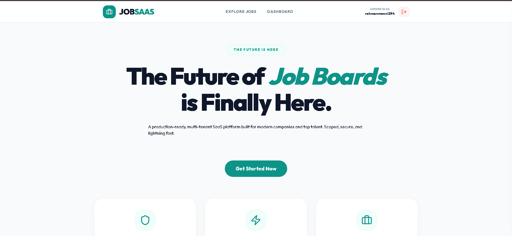
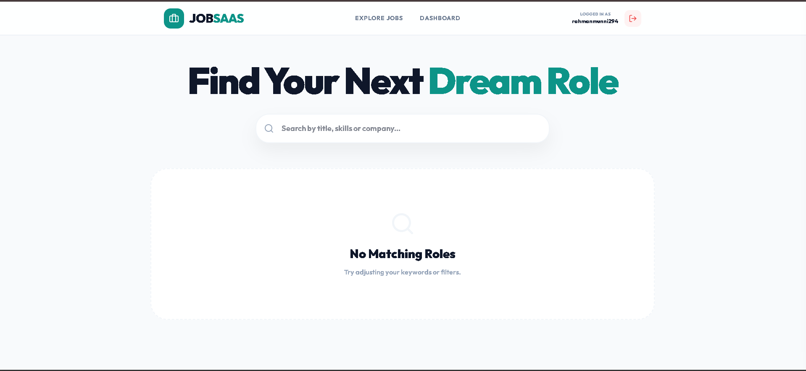
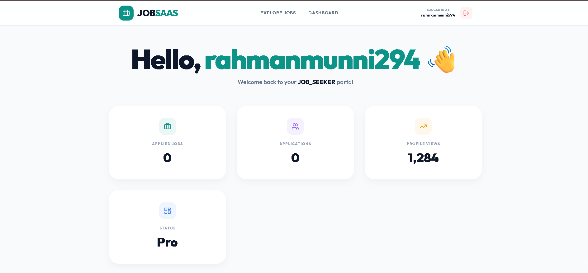

# 💼 JobSaaS — A Premium Full-Stack Job Board & Analytics Dashboard

JobSaaS is a modern, data-driven career platform I built to bridge the gap between job seekers and recruitment metrics. Instead of a basic job board, this application features a sleek, production-ready SaaS landing page, an optimized search engine, and an interactive analytics dashboard that gives users real-time insights into their application pipeline.

---

## 🚀 Key Features

* **User Authentication & Active Sessions:** Secure signup and login flows that safely handle user profiles and track live sessions (complete with dynamic "Logged In" status flags).
* **High-Converting SaaS Landing Page:** A modern, conversion-focused landing interface designed with premium aesthetic layouts and smooth, clean spacing.
* **Granular Job Search & Discovery:** A responsive filtering engine that lets users instantly search for opportunities by job titles, specific skill sets, or company names.
* **Live Activity Metrics:** A centralized user dashboard tracking real-time data points like applied jobs, application history, and profile views (demonstrated by a live 1,280+ view counter).
* **Tiered Profile Statuses:** Built-in account tier tracking equipped with visual indicators (like Pro/Premium account badges) to distinguish user membership types.
* **Polished, Human-Centered UI:** Ditched the standard generic templates for a custom, premium interface prioritized around user experience, minimal clutter, and accessibility.

---

## 🛠 My Tech Stack

* **Frontend:** React.js, Tailwind CSS, Component-Driven Dashboard Elements
* **Backend:** Node.js, Express.js
* **Database & Architecture:** Relational SQL Database, Prisma ORM

---

## 📸 Inside the Platform (UI Showcase)

<table width="100%">
  <tr>
    <td colspan="2" align="center">
      <b>✨ 1. Premium SaaS Landing Page</b>
        
      
    </td>
  </tr>
  <tr>
    <td width="50%" align="center">
      <b>🔍 2. Intention-Driven Search & Filters</b>
        
      
    </td>
    <td width="50%" align="center">
      <b>📊 3. User Analytics Pipeline Dashboard</b>
        
      
    </td>
  </tr>
</table>

---

> 🔒 **Security & Architecture Note:** To safeguard proprietary business logic, core backend API schemas, and production database structures, the actual underlying code repositories for this project are kept private. This repository serves as a public architectural blueprint, user experience showcase, and documentation hub.
